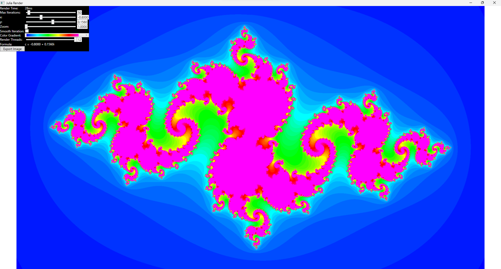

# Ui Julia Render

## Installation (Windows only)

Download the publish.zip of the [latest release](https://github.com/Finnomator/UiJulidaRender/releases/tag/1.0.0.1), extract it, and run the setup.exe.

## Usage

You can interact with the app by using the controls in the top left.

### Controls

#### Sliders

With the x and y slider you can set the constants in the formula to calculate the Julia set.  
If you wish to zoom in on the fractal, click on the focus slider and use the left and right arrow keys to zoom in and out.  
The "Render Threads" Slider controls how many cpu threads should be used to render the fractal, more threads means faster rendering time (displayed in the top).

#### Color Gradient

You can select a grayscale or multicolor color gradient to display the set. There is also a third option which currently does not work as intended.

#### Export Image

This exports the set as an PNG image with a 1920x1080px resolution (which is also the default resolution at which the set gets rendered).
